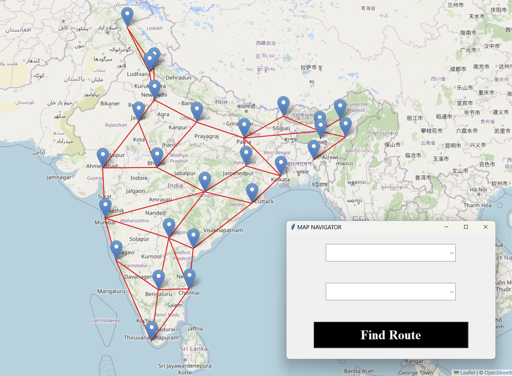
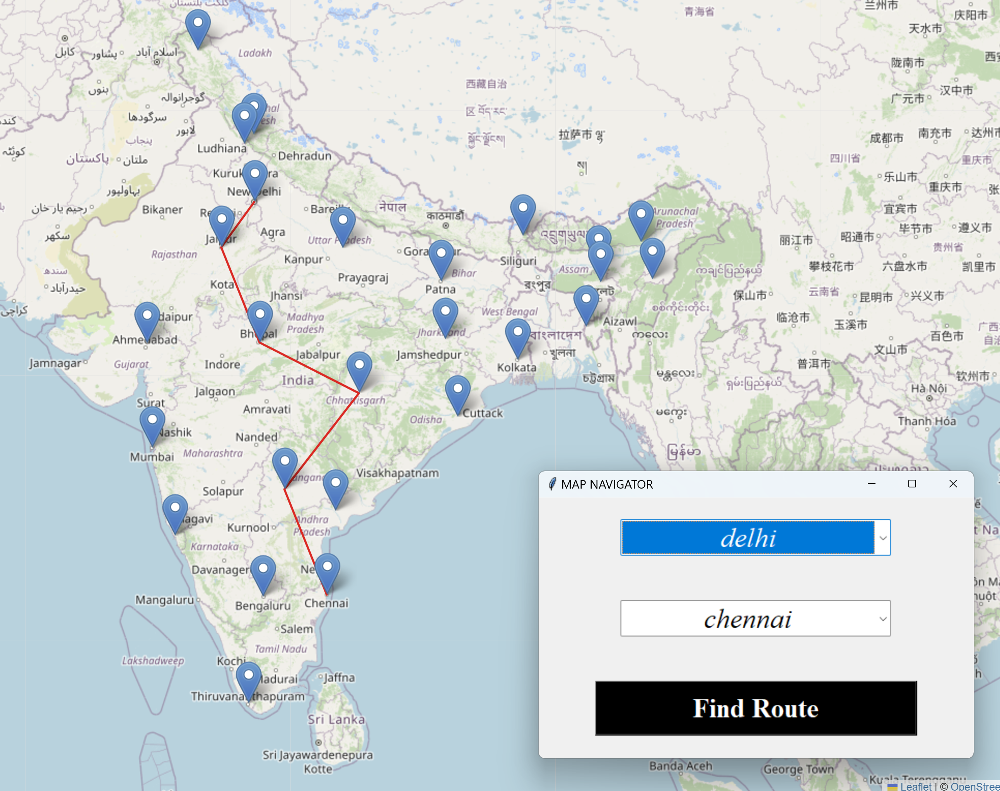

# Map Navigator

## Overview

The **Map Navigator** is a Python based application built using **Tkinter** that allows users to select a source city and a destination city from a list of cities. The system calculates the shortest route between the selected cities using **Dijkstra's algorithm using Fibonacci heap** and visualizes the route on an interactive map generated with **Folium**. 

## Features
- **Dataset**: `cities.csv` consists of cities list along with lattitude and longtitude.
  
- **Graph Construction**: Graph is constructed with cities as nodes, and the edges represent the distances between cities. These distances are calculated based on the latitude and longitude coordinates of the cities.
  
- **Graph-Based Route Navigation**: Choose source and destination cities from a dropdown menu.
  
- **Shortest Path Calculation**: Uses **Dijkstra's algorithm using fibonacci heap** to compute the shortest route.
  
- **Fibonacci heap implementation**: Fibonacci heap is implemented manually , it consists of functions like extract_min, decrease_key, merge, cut, consolidate, find_min.
  
- **Interactive Map**: Generates a map showing the route, which is saved as an HTML file and opened in a web browser.

## Requirements
1. Python 3.x+
2. **Tkinter** (for GUI)
3. **NetworkX** (for graph-based operations)
4. **Folium** (for interactive map generation)
5. **CSV** (for reading city data)

## Example Output

### 1. Input

### 2. Output

